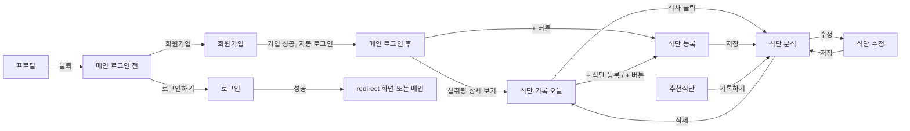

# YamYam 화면 설계

> HTML/CSS와 JS가 **같은 이름을 쓰기 위한 약속**입니다. 지금 저장소의 HTML 기준으로 정리했습니다.
> 색, 배치, 꾸밈은 자유롭게 바꿔도 되지만, 이 문서의 **id, name, data-속성, 파일 경로**를 바꿀 때는 JS 담당과 먼저 맞춰 주세요.
> 실행 방법·폴더 구조·계산 규칙은 [README](../README.md)에 있습니다.

---

## 1. 화면 목록

| 화면 | HTML | CSS | JS | 로그인 |
|---|---|---|---|---|
| 메인 | `index.html` | `css/pages/main.css` | `js/pages/main.js` | 누구나 (로그인 여부에 따라 내용이 다름) |
| 로그인 | `pages/login.html` | `css/pages/login.css` | `js/pages/login.js` | 비회원만 |
| 회원가입 | `pages/signup.html` | `login.css` + `css/pages/signup.css` | `js/pages/signup.js` | 비회원만 |
| 식단 기록 | `pages/meal-list.html` | `css/pages/meal-list.css` | `js/pages/meal-list.js` | 회원만 |
| 식단 등록·수정 | `pages/meal-form.html` | `css/pages/meal-form.css` | `js/pages/meal-form.js` | 회원만 |
| 식단 분석 | `pages/meal-detail.html` | `css/pages/meal-detail.css` | `js/pages/meal-detail.js` | 회원만 |
| 추천식단 | `pages/recommend.html` | `css/pages/recommend.css` | `js/pages/recommend.js` | 회원만 |
| 프로필 | `pages/mypage.html` | `css/pages/mypage.css` | `js/pages/mypage.js` | 회원만 |

- **비회원만**: 이미 로그인한 상태로 들어오면 메인으로 이동합니다.
- **회원만**: 로그인하지 않았으면 `login.html?redirect=원래주소`로 이동하고, 로그인하면 원래 화면으로 돌아옵니다.

## 2. 화면 이동 흐름



| 동작 | 결과 |
|---|---|
| 로그아웃 (헤더 사람 아이콘 메뉴) | 메인으로 이동 |
| 회원가입 성공 | 자동 로그인 → 메인 |
| 식단 저장 (작성·수정), 추천 기록하기 | 그 식단의 분석 화면 |
| 식단 삭제 | 확인 창 → 삭제 → 식단 기록 |
| 프로필 수정 | 같은 화면에서 정보 다시 표시 + "수정되었습니다." |
| 회원 탈퇴 | 확인 창 → 탈퇴 → 메인 |
| 없는 식단·남의 식단 주소 | 안내 창 → 식단 기록 |

---

## 3. 공통 규칙

### 3-1. 스크립트
```html
<!-- index.html -->
<script type="module" src="js/pages/main.js"></script>
<!-- pages/*.html -->
<script type="module" src="../js/pages/meal-list.js"></script>
```
`type="module"`이 없으면 동작하지 않습니다. Live Server로 여세요.

### 3-2. 보이기·숨기기는 `hidden`
JS는 `hidden` 속성을 넣고 빼서 요소를 보이고 숨깁니다. (`common.css`에 `[hidden] { display: none !important; }` 있음)

### 3-3. 입력칸 `name`
**서비스 함수의 필드 이름과 똑같이** 씁니다: `userId`, `password`, `passwordConfirm`, `name`, `height`, `weight`, `diseaseInfo`, `goal`, `date`, `mealType`, `foodName`, `calorie`, `carbohydrate`, `protein`, `fat`, `sodium`, `sugar`

### 3-4. 오류 메시지 자리 `data-error`
- 입력칸 바로 아래에 `<p class="error" data-error="필드명"></p>`를 둡니다.
- 폼 전체 오류(로그인 실패, 권한 없음 등)는 `data-error="form"`. 자리가 없으면 JS가 `alert`로 보여줍니다.
- 성공 안내(사용할 수 있는 아이디, 수정되었습니다)는 같은 자리에 `class="ok"`가 붙어서 나옵니다.
- 입력칸에 다시 입력하면 그 칸의 오류는 자동으로 지워집니다.

### 3-5. 값 채우기 `data-field`
```html
<span data-field="name"></span>님
```
- 숫자는 천 단위 쉼표가 붙어서 들어갑니다(`1300` → `1,300`). 단위(kcal, %)는 HTML에 적습니다.
- `data-field="link"`가 붙은 `<a>`에는 `href`가 들어갑니다.
- `data-field="grade"`에는 글자와 함께 `data-grade="A"` 속성도 붙습니다 → 등급 색은 CSS `[data-grade='A']`

### 3-6. 반복 목록 `<template>`
목록 한 줄 모양을 `<template id="…">`로 만들어 둡니다(바로 안에는 **최상위 요소 하나**). JS가 복사해서 `data-field`를 채워 목록에 넣습니다. 줄 안의 버튼은 `data-action`으로 구분합니다.

### 3-7. 선택지 값 (한글 그대로)
| 항목 | 형태 | 값 |
|---|---|---|
| 끼니 `mealType` | radio | `아침` `점심` `저녁` `간식` |
| 질환 `diseaseInfo` | **checkbox 여러 개** | `없음`(`data-exclusive`) `고혈압` `당뇨` |
| 목표 `goal` | radio | `감량` `유지` `증량` (회원가입 기본값 `유지`) |

- `data-exclusive` 칸(`없음`)을 고르면 다른 칸이 풀리고, 다른 칸을 고르면 `없음`이 풀립니다. 모두 풀리면 `없음`이 다시 선택됩니다.
- JS는 체크박스 묶음을 배열로 읽습니다 → 저장 `diseaseInfo: ['고혈압', '당뇨']`, 없으면 `[]`

### 3-8. 버튼
- `<form>` 안에서 제출이 아닌 버튼에는 `type="button"`을 붙입니다.
- 삭제·탈퇴는 브라우저 기본 `confirm()` 확인 창을 씁니다.

### 3-9. 비밀번호 보기
```html
<div class="field">
  <input name="password" type="password">
  <button type="button" class="toggle-password" data-action="toggle-password" aria-label="비밀번호 보기">
    <svg class="icon-eye">…</svg><svg class="icon-eye-off">…</svg>
  </button>
</div>
```
같은 묶음 안의 입력칸이 보였다 숨었다 하고, 보이는 동안 버튼에 `class="is-visible"`이 붙습니다.

### 3-10. YamYam 달력 (`js/core/datepicker.js`)
브라우저 기본 달력 대신 씁니다. 미래 날짜는 고를 수 없습니다.
```html
<div class="datepicker" data-datepicker>
  <input type="hidden" name="date">
  <button type="button" class="datepicker__trigger">
    <svg>…</svg><span data-datepicker-label></span>   <!-- '10월 2일 (금)' -->
  </button>
</div>
```
날짜를 고르면 숨은 `input`의 값이 바뀌고 `change` 이벤트가 발생합니다. 기록이 있는 날에는 초록 점이 찍힙니다.

### 3-11. 막대
```html
<div class="bar" id="day-kcal"><div class="bar-fill"></div></div>
```
JS가 `.bar-fill`의 너비(0~100%)와 바깥 요소의 CSS 변수 `--percent`를 넣습니다.

### 3-12. 화면 전환
- 같은 사이트 링크를 누르면 `<html>`에 `.is-leaving`이 붙어 내용이 사라진 뒤 이동합니다(`ui.js`의 `go()`).
- 새 화면에서는 `.page`, `.home`, `.auth__panel`이 떠오르며 나타납니다. 헤더는 움직이지 않습니다.
- 이 세 요소 **안에 `position: fixed` 요소를 두면 화면이 아니라 그 요소에 붙습니다.** 고정 버튼(+)은 바깥에 둡니다.

---

## 4. 공통 헤더 (회원 화면)

```html
<header class="site-header" data-auth="member">
  <a class="logo" href="../index.html">YamYam</a>
  <nav class="site-nav">
    <a class="site-nav__link" href="meal-list.html" aria-current="page">식단 기록</a>
    <a class="site-nav__link" href="recommend.html">추천식단</a>
    <a class="site-nav__link" href="mypage.html">프로필</a>
    <details class="profile-menu">
      <summary aria-label="내 메뉴">…</summary>
      <div class="profile-menu__panel">
        <p class="profile-menu__name"><span data-field="name"></span>님</p>
        <a class="profile-menu__item" href="mypage.html">프로필</a>
        <button class="profile-menu__item" type="button" id="logout-btn">로그아웃</button>
      </div>
    </details>
  </nav>
</header>
```
- 지금 화면의 메뉴에 `aria-current="page"` → 진한 밑줄
- `data-auth="member"`/`"guest"`가 붙은 요소는 어디에 있든 로그인 상태에 맞춰 보이거나 숨겨집니다.
- 링크 주소는 `index.html`에서는 `pages/…`, `pages/` 안에서는 파일 이름만 씁니다.

---

## 5. 메인 `index.html`

로그인 전·후 화면이 **한 파일**에 있습니다. JS가 하나만 보여줍니다.

**로그인 전** `<main class="home home--guest" data-auth="guest">`

| 요소 | 속성 | 비고 |
|---|---|---|
| 접시 | `.plate-wrap` > `.plate.plate--hero` > `.plate__img` | 로그인·회원가입으로 넘어갈 때 움직이는 접시 |
| 로그인하기 / 회원가입 링크 | `data-action="plate-transition"` | 누르면 접시가 왼쪽으로 미끄러지며 90도 돈 뒤 이동 |

**로그인 후** `<main class="home home--member" data-auth="member" hidden>`

| 표시 | `data-field` / id | 예 |
|---|---|---|
| 오늘 섭취 비율 | `todayRate` | 65 (%는 HTML) |
| 오늘 먹은 열량 / 하루 권장 | `todayCalorie` / `targetKcal` | 1,300 / 1,950 |
| 이름 / 응원 문구 | `name` / `todayMessage` | 테스트 / 조금만 힘내보세요! |
| 섭취량 상세 보기 | `#nutrition-link` | JS가 `meal-list.html?date=오늘`로 연결 |
| + 버튼 (main 밖) | `<a class="fab" data-auth="member" hidden href="pages/meal-form.html">` + `<span class="fab__label">식단 등록</span>` | 호버하면 이름표 |

응원 문구: 기록 없음 "오늘 첫 끼를 기록해 보세요!" · 50% 미만 "든든하게 챙겨 드세요!" · 50~89% "조금만 힘내보세요!" · 90~110% "딱 좋아요!" · 110% 초과 "오늘은 조금 많이 드셨어요."

**접시 전환 효과 주의**
- `index.html`의 `<head>`에 있는 작은 스크립트(`.plate-arrive`)는 **지우지 마세요.** 로그인·회원가입에서 돌아올 때 접시가 튀지 않게 화면이 그려지기 전에 실행돼야 합니다.
- 로그인 화면 접시 자리(`login.css`의 `.auth__visual .plate-wrap` 크기·`left`)를 바꾸면 `main.js`의 `loginPlateTransform()` 계산도 같이 바꿔야 끊김이 없습니다.
- 860px 이하이거나 '움직임 줄이기' 설정이면 애니메이션 없이 이동합니다.

---

## 6. 로그인·회원가입

공통 틀: `<main class="auth">` 안에 접시 `.auth__visual`(화면 왼쪽에 고정, 약 65% 노출)과 폼 `.auth__panel`(화면 정중앙)

### 6-1. 로그인 `pages/login.html`
| 요소 | id / 속성 |
|---|---|
| 폼 | `#login-form` |
| 아이디 / 비밀번호 | `name="userId"` / `name="password"` + 비밀번호 보기 |
| 오류 | `data-error="userId"`, `"password"`, `"form"`("아이디 또는 비밀번호가 올바르지 않습니다.") |

### 6-2. 회원가입 `pages/signup.html`
| 요소 | id / 속성 | 규칙 |
|---|---|---|
| 폼 | `#signup-form` | |
| 아이디 + 중복 확인 | `name="userId"`, `#check-id-btn` | 영문 소문자·숫자 4~16자 |
| 비밀번호 / 확인 | `name="password"` / `name="passwordConfirm"` | 4~20자 |
| 이름 | `name="name"` | 1~20자 |
| 키 / 몸무게 | `name="height"` / `name="weight"` (number) | 100~250cm / 20~300kg |
| 질환 | `name="diseaseInfo"` checkbox 3개 | 3-7 참고 |
| 목표 | `name="goal"` radio 3개 | 기본 `유지` |
| 오류 | 각 `data-error="필드명"` + `"form"` | |

---

## 7. 식단 기록 `pages/meal-list.html`

하루 단위 화면입니다. 주소에 `?date=2026-10-01`이 있으면 그날, 없으면 오늘을 보여줍니다.

| 요소 | id / 속성 | 비고 |
|---|---|---|
| 날짜 폼 | `#meal-filter` 안에 YamYam 달력(`name="date"`) | 날짜를 바꾸면 요약·목록이 바로 바뀜 |
| 전날 / 다음 날 | `#date-prev` / `#date-next` | 오늘이면 다음 날 버튼 비활성 |
| 하루 요약 | `#day-summary` | 아래 표 |
| 식사 수 | `data-field="mealCount"` | |
| + 식단 등록 (글씨 링크) | `.meals__add` → `meal-form.html` | |
| 식사 목록 | `#meal-list` + `<template id="meal-item">` | 아침 → 간식 순 |
| 기록 없음 | `#meal-empty` | |
| + 버튼 (main 밖) | `.fab` → `meal-form.html` | 이름표 "식단 등록" |

`#day-summary` 안: `calorie`, `targetKcal`, `kcalRate`, `carbohydrate`, `protein`, `fat`, `sodium`, `sugar` (`data-field`), 열량 막대 `#day-kcal`, 탄단지 막대 `#day-macro-carb` / `-protein` / `-fat` (각각 안에 `data-field="value"`와 `.bar`)

`#meal-item` 안: `link`, `mealType`, `foodNames`(예: "현미밥, 연어구이 외 1개"), `calorie`, `score`, `grade`

---

## 8. 식단 등록·수정 `pages/meal-form.html`

주소에 `?id=3`이 있으면 수정(제목 `data-field="title"`이 "식단 수정"으로 바뀌고 기존 값이 채워짐), 없으면 작성입니다.

**왼쪽: 음식 찾기** (`<form>` 바깥)

| 요소 | id / 속성 | 비고 |
|---|---|---|
| 검색창 | `#food-search` | 입력을 멈추면 0.3초 뒤 검색, 엔터로 저장되지 않음 |
| 결과 목록 | `#food-results` + `<template id="food-result-item">` | `foodName`, `servingText`("1회 230g" / "직접 입력"), `calorie` + 담기 `data-action="add"` |
| 결과 없음 | `#food-results-empty` | 검색어가 있을 때만 |
| 직접 입력 열기 | `#custom-food-open` | 누를 때마다 폼이 열리고 닫힘 |
| 직접 입력 폼 | `#custom-food-form` (처음엔 `hidden`) | `foodName`, `calorie`, `carbohydrate`, `protein`, `fat`, `sodium`, `sugar` (1회분), 저장하면 바로 담김 |

**오른쪽: 내 식단** `#meal-form`

| 요소 | id / 속성 | 비고 |
|---|---|---|
| 날짜 | YamYam 달력 `name="date"` | 기본 오늘 |
| 끼니 | `name="mealType"` radio 4개 | |
| 담은 음식 | `#selected-foods` + `<template id="selected-food-item">` | `foodName`, `calorie` + 빼기 `data-action="remove"` |
| 담은 음식 없음 | `#selected-empty` | |
| 합계 열량 | `data-field="totalCalorie"` | |
| 오류 | `data-error="date"`, `"mealType"`, `"foods"`, `"form"` | |
| 취소 | `#cancel-btn` | 작성은 식단 기록, 수정은 분석 화면으로 |

---

## 9. 식단 분석 `pages/meal-detail.html?id=3`

| 요소 | id / `data-field` | 비고 |
|---|---|---|
| 날짜 / 끼니 | `date` / `mealType` | |
| 수정 / 삭제 | `#edit-btn` / `#delete-btn` | |
| 점수 / 등급 | `score` / `grade` | |
| 열량 / 목표 / % | `calorie` / `targetKcal` / `kcalRate` | |
| 조언 | `#advice-list` (`<ul>`) | JS가 `<li>`를 1~2개 넣음, 핵심 부분은 `<strong>` |
| 탄단지 막대 | `#macro-carb`, `#macro-protein`, `#macro-fat` | 각 안에 `data-field="value"`, `.bar` |
| 음식 표 | `<tbody id="food-rows">` + `<template id="food-row">` | `foodName`, `calorie`, `carbohydrate`, `protein`, `fat`, `sodium`, `sugar` (소수 한 자리) |
| 합계 | `<tfoot id="food-total">` | 같은 `data-field`. `#food-rows` 안에 두면 안 됨(매번 다시 그려짐) |

---

## 10. 추천식단 `pages/recommend.html`

| 요소 | id / 속성 | 비고 |
|---|---|---|
| 질환 | `data-field="diseaseInfo"` | "고혈압, 당뇨" / "없음" |
| 오늘 남은 열량 | `data-field="remainKcal"` | 하루 권장 − 오늘 먹은 양 |
| 끼니 선택 | `#recommend-filter` 안 `name="mealType"` radio | 처음엔 오늘 아직 안 먹은 첫 끼니 |
| 추천 목록 | `#recommend-list` + `<template id="recommend-item">` | `rank`, `foodNames`("현미밥 · 된장찌개 · …"), `calorie`, `reason`, `grade` + `data-action="record"` |

기록하기를 누르면 오늘 날짜·선택한 끼니로 저장하고 분석 화면으로 이동합니다.

---

## 11. 프로필 `pages/mypage.html`

**내 정보**: `name`, `userId`, `goalLabel`("체중 유지"), `diseaseInfo`, `height`, `weight`, `bmi`, `bmiLabel`, `targetKcal` (`data-field`)

**프로필 수정** `#user-form`: `name`, `height`, `weight`, `diseaseInfo`(checkbox), `goal`(radio), `password`·`passwordConfirm`(비워 두면 그대로). 아이디는 바꿀 수 없습니다. 성공하면 `data-error="form"` 자리에 "수정되었습니다."

**회원 탈퇴** `#withdraw-form`: 맨 아래 `<details class="withdraw">` 안(눌러야 펼쳐짐), `name="password"`로 본인 확인 → 확인 창 → 탈퇴

`#user-form`과 `#withdraw-form`은 **서로 다른 `<form>`** 이어야 합니다.

---

## 12. 정할 것

- [ ] 확인 창을 기본 `confirm()` 대신 직접 만든 모달로 바꿀지
- [ ] 성공 메시지를 토스트(잠깐 떴다 사라지는 알림)로 바꿀지 (현재: 화면 안 글자)
- [ ] 직접 입력한 음식을 회원별로 나눌지 (현재: 모든 회원 공유)
- [ ] 한 음식을 여러 개(밥 2공기) 담는 수량 기능 (현재: 같은 음식을 두 번 담기)
- [ ] 식단 등록 화면의 음식 **분류별 둘러보기** 화면 연결 (`foodService.getFoodCategories` / `browseFoods`는 준비됨)
- [ ] 응원 문구 구간과 문구 확정
- [x] 회원가입 후 자동 로그인 → 메인
- [x] 로그아웃은 헤더 사람 아이콘 메뉴 안
- [x] 질환 여러 개 선택, 체중 목표(감량·유지·증량) 반영
- [x] 추천식단: 집밥 메뉴로 한식 상차림 조합
