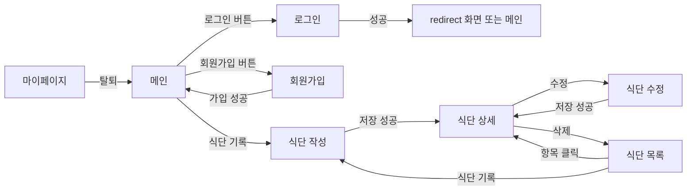

# 냠냠코치 화면 설계 (초안)

> HTML/CSS 담당과 JS 담당이 **같은 이름을 쓰기 위한 약속**입니다.
> 색, 배치, 꾸밈은 자유롭게 바꿔도 되지만, 이 문서의 **id, name, data-속성, 파일 경로**는 바꾸기 전에 서로 말해 주세요.
> 정해지지 않은 부분은 맨 아래 [정할 것](#8-정할-것)에 모아 두었습니다.

---

## 1. 화면 목록

| 화면 | HTML | CSS | JS | 로그인 |
|---|---|---|---|---|
| 메인 | `index.html` | `css/pages/main.css` | `js/pages/main.js` | 누구나 (로그인 여부에 따라 내용이 다름) |
| 로그인 | `pages/login.html` | `css/pages/login.css` | `js/pages/login.js` | 비회원만 |
| 회원가입 | `pages/signup.html` | `css/pages/signup.css` | `js/pages/signup.js` | 비회원만 |
| 식단 목록 | `pages/meal-list.html` | `css/pages/meal-list.css` | `js/pages/meal-list.js` | 회원만 |
| 식단 작성·수정 | `pages/meal-form.html` | `css/pages/meal-form.css` | `js/pages/meal-form.js` | 회원만 |
| 식단 상세·분석 | `pages/meal-detail.html` | `css/pages/meal-detail.css` | `js/pages/meal-detail.js` | 회원만 |
| 마이페이지 | `pages/mypage.html` | `css/pages/mypage.css` | `js/pages/mypage.js` | 회원만 |

- **비회원만**: 이미 로그인한 상태로 들어오면 메인으로 이동합니다.
- **회원만**: 로그인하지 않은 상태로 들어오면 `login.html?redirect=원래주소`로 이동하고, 로그인에 성공하면 원래 화면으로 돌아옵니다.

## 2. 화면 이동 흐름



| 동작 | 결과 |
|---|---|
| 로그아웃 (헤더) | 메인으로 이동 |
| 회원가입 성공 | 자동으로 로그인한 뒤 메인으로 이동 |
| 식단 저장 성공 (작성·수정) | 그 식단의 상세 화면으로 이동 |
| 식단 삭제 | 확인 창 → 삭제 → 목록으로 이동 |
| 회원 정보 수정 성공 | 같은 화면에서 정보 다시 표시 + "수정되었습니다." |
| 회원 탈퇴 | 확인 창 → 탈퇴 → 메인으로 이동 |
| 없는 식단이나 남의 식단 주소로 접근 | 안내 메시지 → 목록으로 이동 |

---

## 3. 공통 규칙

### 3-1. 스크립트 불러오기
```html
<!-- index.html -->
<script type="module" src="js/pages/main.js"></script>
<!-- pages/*.html -->
<script type="module" src="../js/pages/meal-list.js"></script>
```
`type="module"`이 없으면 동작하지 않습니다. 파일을 Live Server로 열어야 합니다.

### 3-2. 보이기·숨기기는 `hidden`
JS는 `hidden` 속성을 넣거나 빼서 요소를 보이고 숨깁니다.
CSS에서 `display`를 지정하면 `hidden`이 무시되니 공통 CSS에 아래 한 줄을 넣어 주세요.
```css
[hidden] { display: none !important; }
```

### 3-3. 폼 입력칸의 `name`
입력칸의 `name`은 **서비스 함수가 받는 필드 이름과 똑같이** 씁니다. (예: `userId`, `password`, `mealType`)

### 3-4. 오류 메시지 자리
- 입력칸마다 바로 아래에 빈 오류 자리를 둡니다. JS가 여기에 글자를 넣습니다.
- 폼 전체에 대한 오류(로그인 실패, 권한 없음 등)는 `data-error="form"` 자리에 넣습니다.
```html
<input name="userId">
<p class="error" data-error="userId"></p>
...
<p class="error" data-error="form"></p>
```

### 3-5. 값 채우기는 `data-field`
JS가 값을 넣을 자리에는 `data-field="필드명"`을 붙입니다.
```html
<span data-field="name"></span>님, 안녕하세요
```

### 3-6. 반복 목록은 `<template>`
목록 한 줄의 모양을 `<template>`로 만들어 두면 (`<template>` 바로 안에는 **최상위 요소 하나**만), JS가 복사해서 `data-field`만 채운 뒤 목록 영역에 넣습니다.
버튼은 `data-action`으로 구분합니다.
```html
<ul id="meal-list"></ul>
<template id="meal-item">
  <li>
    <a data-field="link">
      <span data-field="date"></span> <span data-field="mealType"></span>
      <span data-field="calorie"></span>kcal
    </a>
  </li>
</template>
```
`data-field="link"`가 붙은 `<a>`는 JS가 `href`를 넣습니다.

### 3-7. 선택지 값은 한글 그대로
끼니와 질환 정보의 `value`는 아래 글자와 **정확히** 같아야 합니다.
- 끼니: `아침`, `점심`, `저녁`, `간식`
- 질환 정보: `없음`, `고혈압`, `당뇨`

### 3-8. 버튼 안전장치
`<form>` 안의 `<button>`은 `type`을 적지 않으면 폼 제출 버튼이 됩니다. 담기·빼기처럼 제출이 아닌 버튼에는 `type="button"`을 붙여 주세요. (JS에서도 막아 두었지만 붙이는 것이 안전합니다)

### 3-9. 확인 창
삭제와 탈퇴는 브라우저 기본 `confirm()`을 씁니다. (직접 만든 모달로 바꿀지는 [정할 것](#8-정할-것) 참고)

---

## 4. 공통 헤더 (모든 화면)

| 요소 | id / 속성 | 보이는 때 | 동작 |
|---|---|---|---|
| 로고 | `<a>` | 항상 | 메인으로 이동 (경로만 맞추면 JS 필요 없음) |
| 회원 메뉴 묶음 | `data-auth="member"` | 로그인 | |
| └ 식단 목록 링크 | `<a>` | | `pages/meal-list.html` |
| └ 식단 기록 링크 | `<a>` | | `pages/meal-form.html` |
| └ 마이페이지 링크 | `<a>` | | `pages/mypage.html` |
| └ 회원 이름 | `data-field="name"` | | JS가 이름을 넣음 |
| └ 로그아웃 버튼 | `#logout-btn` | | 로그아웃 → 메인 |
| 비회원 메뉴 묶음 | `data-auth="guest"` | 비로그인 | |
| └ 로그인 링크 | `<a>` | | `pages/login.html` |
| └ 회원가입 링크 | `<a>` | | `pages/signup.html` |

`data-auth`가 붙은 요소는 헤더 밖에 있어도 JS가 로그인 상태에 맞춰 보이거나 숨깁니다.
링크 주소는 `index.html`에서는 `pages/...`, `pages/` 안에서는 `...` 처럼 위치에 맞게 적어 주세요.

---

## 5. 회원 화면

### 5-1. 로그인 `pages/login.html`

| 요소 | id / 속성 | 동작 |
|---|---|---|
| 폼 | `#login-form` | 제출하면 로그인 |
| 아이디 | `name="userId"` + `data-error="userId"` | |
| 비밀번호 | `name="password"` (type=password) + `data-error="password"` | |
| 로그인 버튼 | `type="submit"` | |
| 실패 메시지 | `data-error="form"` | "아이디 또는 비밀번호가 올바르지 않습니다." |
| 회원가입 링크 | `<a href="signup.html">` | |

- 빈칸이면 로그인을 시도하지 않고 해당 칸 아래에 오류를 표시합니다.
- 성공하면 주소의 `redirect` 값이 있으면 그 화면으로, 없으면 메인으로 이동합니다.

### 5-2. 회원가입 `pages/signup.html`

| 요소 | id / 속성 | 비고 |
|---|---|---|
| 폼 | `#signup-form` | |
| 아이디 | `name="userId"` | 영문 소문자·숫자 4~16자 |
| 중복 확인 버튼 | `#check-id-btn` (type=button) | 결과를 `data-error="userId"` 자리에 표시 |
| 비밀번호 | `name="password"` | 4~20자 |
| 비밀번호 확인 | `name="passwordConfirm"` | |
| 이름 | `name="name"` | 1~20자 |
| 키 | `name="height"` (type=number) | 100~250 cm |
| 몸무게 | `name="weight"` (type=number) | 20~300 kg |
| 질환 정보 | `name="diseaseInfo"` (select 또는 radio) | `없음` / `고혈압` / `당뇨` |
| 가입 버튼 | `type="submit"` | |
| 각 칸 오류 | `data-error="필드명"` | 위 name과 같은 이름 |

- 중복 확인 결과: 사용 가능하면 "사용할 수 있는 아이디입니다." (오류 자리에 `class="ok"`를 붙여 색을 다르게 할 수 있음)
- 중복 확인을 누르지 않고 가입해도 가입할 때 한 번 더 검사합니다.

### 5-3. 마이페이지 `pages/mypage.html`

**내 정보 영역**

| 표시 | `data-field` |
|---|---|
| 아이디 | `userId` |
| 이름 | `name` |
| 키 / 몸무게 | `height` / `weight` |
| 질환 정보 | `diseaseInfo` |
| BMI / 판정 | `bmi` / `bmiLabel` (저체중·정상·과체중·비만) |
| 하루 권장 칼로리 | `targetKcal` |

**정보 수정 폼** `#user-form`

| 입력 | name | 비고 |
|---|---|---|
| 새 비밀번호 | `password` | 비워 두면 바뀌지 않음 |
| 새 비밀번호 확인 | `passwordConfirm` | |
| 이름 / 키 / 몸무게 / 질환 정보 | `name` / `height` / `weight` / `diseaseInfo` | 화면에 들어오면 현재 값이 채워져 있음 |
| 결과 메시지 | `data-error="form"` | 성공 시 "수정되었습니다." |

아이디는 바꿀 수 없으므로 입력칸을 두지 않습니다.

**회원 탈퇴 폼** `#withdraw-form`

| 입력 | name | 비고 |
|---|---|---|
| 비밀번호 | `password` | 본인 확인용, 오류는 `data-error="password"` |
| 탈퇴 버튼 | `type="submit"` | 확인 창을 띄운 뒤 탈퇴 |

`#user-form`과 `#withdraw-form`은 **서로 다른 `<form>`** 이어야 합니다. (폼 안에 폼을 넣을 수 없음)

---

## 6. 식단 화면

### 6-1. 식단 목록 `pages/meal-list.html`

| 요소 | id / 속성 | 동작 |
|---|---|---|
| 필터 폼 | `#meal-filter` | 값을 바꾸면 바로 목록을 다시 보여줌 |
| └ 날짜 | `name="date"` (type=date) | 비우면 전체 날짜 |
| └ 끼니 | `name="mealType"` (select) | 첫 옵션 `<option value="">전체</option>` |
| 식단 기록 버튼 | `<a href="meal-form.html">` | |
| 목록 영역 | `#meal-list` | |
| 목록 한 줄 | `<template id="meal-item">` | 아래 필드 |
| 결과 없음 | `#meal-empty` | 식단이 없을 때만 보임 |

`#meal-item` 안의 `data-field`

| 필드 | 내용 |
|---|---|
| `link` | `<a>`에 붙이면 상세 화면 주소가 들어감 |
| `date` | 2026-10-01 |
| `mealType` | 아침 |
| `foodNames` | 현미밥, 스크램블드에그 외 1개 |
| `calorie` | 총 열량 (숫자만, 단위는 HTML에 직접) |
| `score` | 점수 0~100 |
| `grade` | A~D (`data-grade="A"` 속성도 함께 붙여 주므로 등급별 색은 CSS에서 `[data-grade="A"]`로 지정) |

정렬: 최신 날짜부터, 같은 날은 간식 → 저녁 → 점심 → 아침 순서.

### 6-2. 식단 작성·수정 `pages/meal-form.html`

- 주소에 `?id=3`이 있으면 **수정**, 없으면 **작성**입니다.
- 수정이면 제목(`data-field="title"`)을 "식단 수정"으로 바꾸고, 기존 값을 채워 둡니다.

**식단 폼** `#meal-form`

| 요소 | id / 속성 | 비고 |
|---|---|---|
| 날짜 | `name="date"` (type=date) | 기본값 오늘, 미래 날짜 선택 불가 |
| 끼니 | `name="mealType"` (radio 4개 또는 select) | |
| 담은 음식 목록 | `#selected-foods` | |
| 담은 음식 한 줄 | `<template id="selected-food-item">` | `foodName`, `calorie` + 빼기 버튼 `data-action="remove"` |
| 담은 음식이 없을 때 | `#selected-empty` | "음식을 검색해서 추가하세요" |
| 합계 열량 | `data-field="totalCalorie"` | 담을 때마다 바로 바뀜 |
| 음식 오류 | `data-error="foods"` | "음식을 1개 이상 추가하세요." |
| 저장 버튼 | `type="submit"` | |
| 취소 | `#cancel-btn` (`<a>` 또는 `<button>`) | 작성은 목록, 수정은 상세로 |

**음식 검색** (식단 폼 안에 있어도 됨, 단 `<form>`이 아닌 영역)

| 요소 | id / 속성 | 비고 |
|---|---|---|
| 검색창 | `#food-search` (type=search) | 입력을 멈추면 0.3초 뒤 검색 |
| 검색 결과 | `#food-results` | |
| 결과 한 줄 | `<template id="food-result-item">` | `foodName`, `servingText`(1회 230g / 직접 입력), `calorie` + 담기 버튼 `data-action="add"` |
| 결과 없음 | `#food-results-empty` | "찾는 음식이 없나요? 직접 입력해 보세요" |

**음식 직접 입력 폼** `#custom-food-form` (식단 폼 **바깥**에 따로 두기)

| 입력 | name | 비고 |
|---|---|---|
| 음식 이름 | `foodName` | 1~30자 |
| 열량 (kcal) | `calorie` | 1회분 기준, 0 이상 |
| 탄수화물 / 단백질 / 지방 (g) | `carbohydrate` / `protein` / `fat` | |
| 나트륨 / 당류 | `sodium` (mg) / `sugar` (g) | |
| 추가 버튼 | `type="submit"` | 저장 후 담은 음식 목록에 바로 추가, 폼 비움 |

열고 닫는 방식(접기, 모달 등)은 자유입니다. JS는 열기 버튼 `#custom-food-open`을 누를 때마다 `#custom-food-form`의 `hidden`을 넣었다 뺐다 합니다.
처음에 닫혀 있게 하려면 HTML에서 `#custom-food-form`에 `hidden`을 붙여 두세요.

### 6-3. 식단 상세·분석 `pages/meal-detail.html?id=3`

**기본 정보**

| 요소 | id / 속성 |
|---|---|
| 날짜 / 끼니 | `data-field="date"` / `data-field="mealType"` |
| 수정 버튼 | `#edit-btn` (`<a>` 또는 `<button>`, JS가 `meal-form.html?id=3`으로 연결) |
| 삭제 버튼 | `#delete-btn` |

**음식 표**: `<tbody id="food-rows">`에 `<template id="food-row">`(`<tr>` 한 줄)를 음식 수만큼 넣습니다.
한 줄의 `data-field`: `foodName`, `calorie`, `carbohydrate`, `protein`, `fat`, `sodium`, `sugar`
합계 줄은 `<tfoot id="food-total">` 안에 같은 이름의 `data-field`로 둡니다. (`#food-rows`는 JS가 매번 비우고 다시 채우므로 합계 줄을 그 안에 넣으면 안 됨)
```html
<table>
  <thead>…</thead>
  <tbody id="food-rows"></tbody>
  <tfoot id="food-total"><tr><th>합계</th><td data-field="calorie"></td>…</tr></tfoot>
</table>
<template id="food-row"><tr><td data-field="foodName"></td><td data-field="calorie"></td>…</tr></template>
```

**분석 결과**

| 표시 | `data-field` / id | 내용 |
|---|---|---|
| 점수 | `score` | 0~100 |
| 등급 | `grade` | A~D, `data-grade` 속성도 붙음 |
| 열량 | `calorie` / `targetKcal` / `kcalRate` | 650 / 목표 650 kcal / 100% |
| 탄단지 비율 | `#macro-carb`, `#macro-protein`, `#macro-fat` | 아래 참고 |
| 조언 | `#advice-list` (`<ul>`) | JS가 `<li>`를 1~2개 넣음 |

탄단지 비율은 막대 3개로 보여줍니다. 각 id 요소 안에
- `data-field="value"`: 숫자(%)
- `.bar-fill`: JS가 `style.width`를 비율(%)로 바꿈 → 막대 색과 모양은 CSS에서 지정

권장 범위는 탄수화물 55~65%, 단백질 7~20%, 지방 15~30%입니다. (범위를 화면에 적어 주면 좋음)

---

## 7. 메인 `index.html`

**비회원** (`data-auth="guest"`)
- 서비스 소개 문구, 로그인 버튼, 회원가입 버튼 (JS 필요 없음)

**회원** (`data-auth="member"`)

| 요소 | id / 속성 | 내용 |
|---|---|---|
| 인사 | `data-field="name"` | ○○님 |
| 오늘 먹은 열량 | `data-field="todayCalorie"` | 오늘 식단 열량 합계 |
| 하루 권장 열량 | `data-field="targetKcal"` | 몸무게 × 30 |
| 진행 막대 | `#today-progress .bar-fill` | 비율만큼 `style.width` |
| 오늘 식단 목록 | `#today-meals` + `<template id="today-meal-item">` | `link`, `mealType`, `calorie`, `grade` |
| 오늘 식단 없음 | `#today-empty` | "오늘 기록이 없어요" |
| 식단 기록 버튼 | `<a href="pages/meal-form.html">` | |

---

## 8. 정할 것

- [ ] 회원가입 성공 후 **자동 로그인 → 메인**으로 갈지, **로그인 화면**으로 보낼지 (초안: 자동 로그인)
- [ ] 확인 창을 기본 `confirm()`으로 할지, 직접 만든 모달로 할지 (초안: `confirm()`)
- [ ] 성공 메시지(수정 완료 등)를 화면 안 글자로 할지, 잠깐 떴다 사라지는 알림(토스트)으로 할지 (초안: 화면 안 글자)
- [ ] 식단 작성에서 끼니를 radio로 할지 select로 할지 (JS는 둘 다 처리 가능)
- [ ] 음식 직접 입력 폼을 펼치기로 할지, 모달로 할지
- [ ] 직접 입력한 음식을 모든 회원이 공유할지, 회원별로 나눌지 (현재: 공유)
- [ ] 한 음식을 여러 개(예: 밥 2공기) 담는 기능이 필요한지 (현재: 같은 음식을 두 번 담는 방식)
